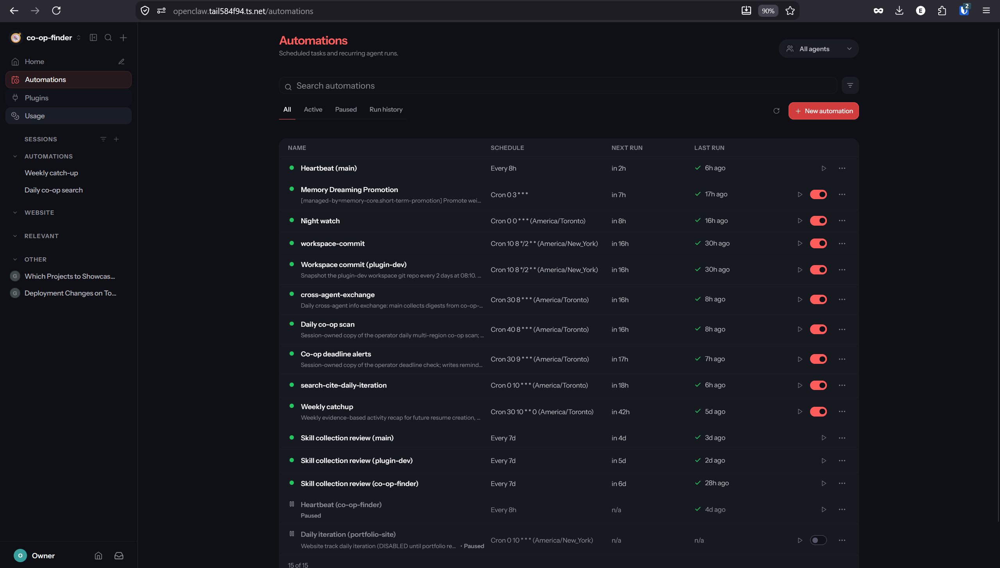
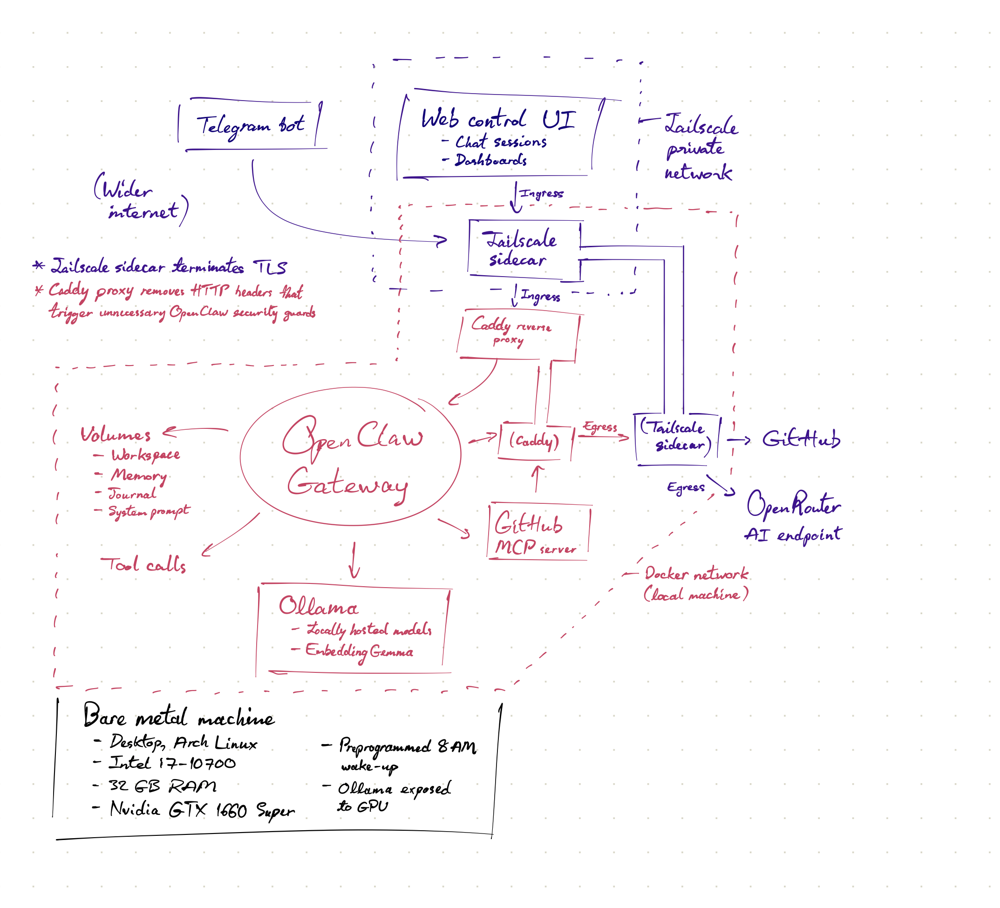

# CHANGES.md — Self-hosting OpenClaw privately on my own stack

The goal was to run the personal AI gateway fully, in a private environment; no exposed ports, and no cloud-hosted gateway.

My OpenClaw setup runs via a modified Docker Compose configuration which personalizes the gateway to my workstation, my resource limits, and my preferences.

## Hardware / Host

- Bare-metal Arch Linux desktop — Intel i7-10700, 32 GB RAM, Nvidia GTX 1660 Super.
- OpenClaw gateway runs in Docker on a dedicated Docker network (local machine); volumes persist workspace, memory, journal, and system prompt.
- Ollama on the same host serves locally hosted models, with the GPU exposed to the container; EmbeddingGemma handles local embeddings.
- Preprogrammed 8 AM wake-up so the box sleeps at night but is warm before the daily automations fire.

## Private ingress (no public exposure)

- Everything is reachable only inside a **Tailscale private network** — the Control UI lives at `openclaw.tail58494.ts.net`. Nothing is port-forwarded.
- A **Tailscale sidecar container** terminates TLS for ingress into the Docker network; the Web Control UI (chat sessions, dashboards) and its automations page are served through it.
- A **Caddy reverse proxy** sits behind the Tailscale sidecar and strips HTTP headers that would otherwise trigger unnecessary OpenClaw security guards — the proxy layer, not the app, absorbs proxy-artifact requests.
- Telegram bot provides a second ingress path from the wider internet for mobile messaging sessions.

## Egress

- Outbound traffic (GitHub API/MCP, OpenRouter AI endpoint) leaves through the **Tailscale sidecar's egress path** rather than opening the gateway container directly to the internet.
- A **GitHub MCP server** container gives the agents structured GitHub tool calls inside the local Docker network.

## What this demonstrates

- Zero-trust-ish private deployment: identity-based access via Tailscale, TLS at the edge, no public attack surface.
- Reverse-proxy debugging at the header level (Caddy removing headers that tripped app-layer security responses).
- Docker networking: ingress sidecar → proxy → gateway, plus isolated egress — all on one bare-metal box.
- GPU-passthrough local inference (Ollama + EmbeddingGemma) alongside a cloud endpoint for reasoning models (OpenRouter).
- Real operations: the automations dashboard runs ~15 scheduled jobs (heartbeats, night watch, workspace commits, cross-agent exchange, deadline alerts) on this stack daily.
